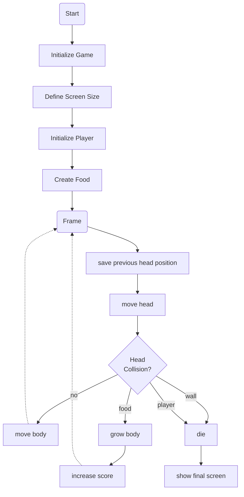

```mermaid
flowchart TD
    Start(Start)
    --> InitGame[Initialize Game]
    --> DefineScreenSize[Define Screen Size]
    --> InitializePlayer[Initialize Player]
    --> CreateFood[Create Food]
    --> Frame(Frame)
    --> PrevHeadPos[save previous head position]
    --> MoveHead[move head]
    --> HeadCollision{Head<br>Collision?}
    HeadCollision -->|no| MoveBody[move body]
     -.-> Frame
    HeadCollision -->|food| GrowBody[grow body]
    --> IncreaseScore[increase score]
    -.-> Frame
    HeadCollision -->|wall| Die[die]
    HeadCollision -->|player| Die
    --> FinalScreen[show final screen]
```
